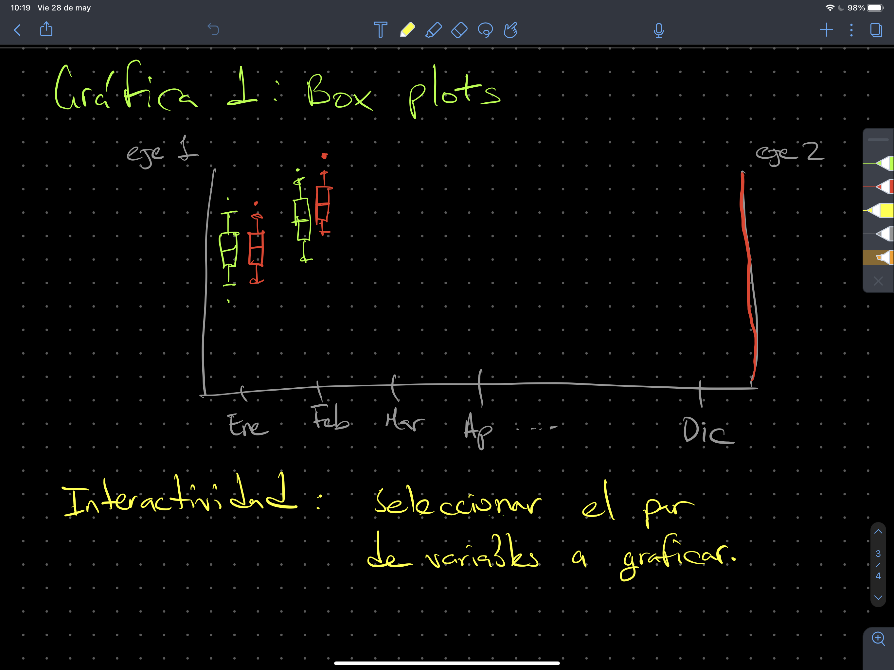
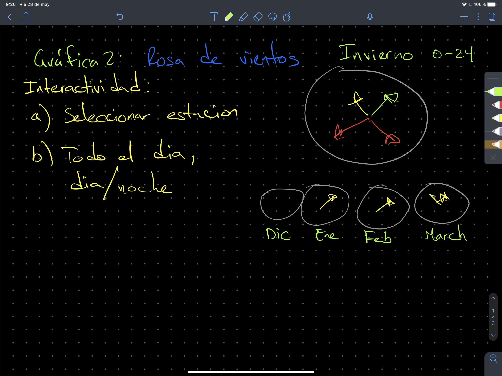
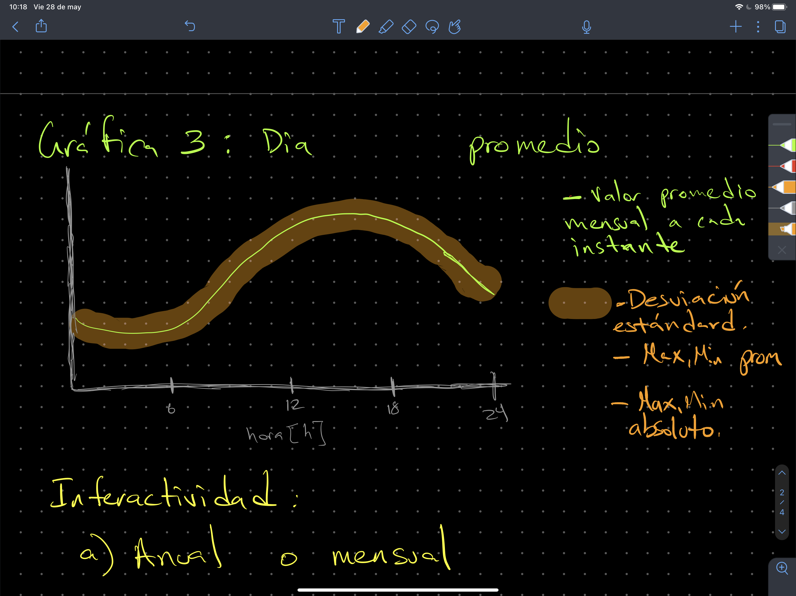
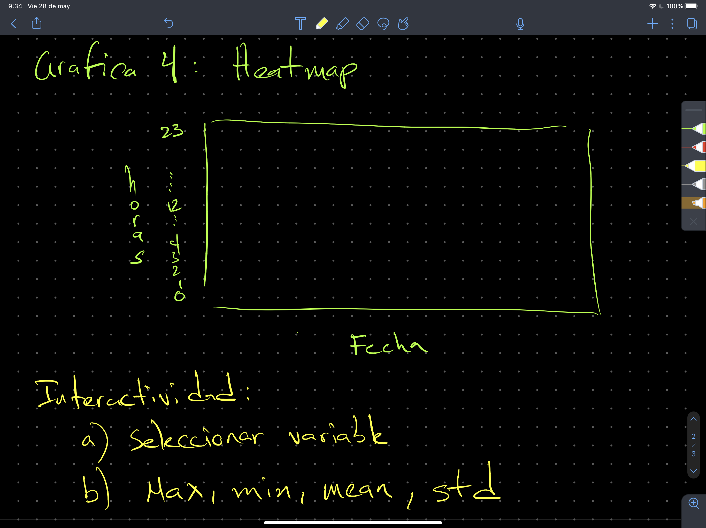

# pf_python2021_IER
Proyecto final para la materia de Python impartida de febrero a junio 2021,
se debe entregar a m'as tardar el d'ia 25 de junio a las 12:00 horas tiempo
del centro de Mx.

Se debe programar una clase que haga lo siguiente:

```
import proyecto as pf

a = pf.analisis()

a.importa('archivo.csv')
```

La clase debe realizar cuatro acciones principalmente:

1. Una gr'afica de boxplot, tomen como guía la siguiente figura:



___


2. Una rosa de vientos, tomen como guía la siguiente figura:



__


3. Un gráfica donde se presente el valor de la variable promediada cada paso
temporal, tomen como referencia la imagen:



___
4. Un  __heatmap__ de la **variable** seleccionada para las horas
y los d'ias , toma como referencia la siguiente imagen:


